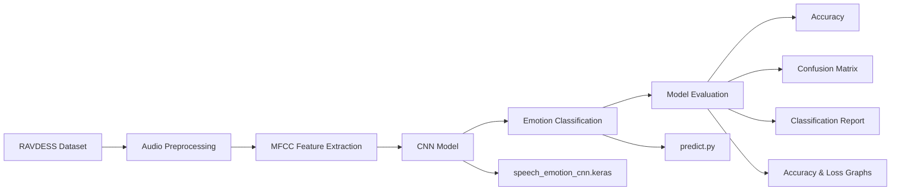
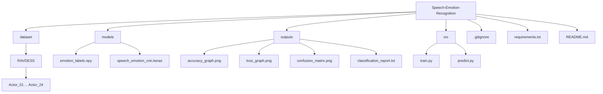

# 🎙️ Speech Emotion Recognition using CNN

A Machine Learning project that recognizes human emotions from speech audio using a Convolutional Neural Network (CNN).

## 📌 Project Overview

Speech contains important emotional information such as tone, pitch, and intensity. This project uses audio feature extraction and deep learning to classify speech into different emotional categories.

The model is trained on the **RAVDESS (Ryerson Audio-Visual Database of Emotional Speech and Song)** dataset.

## 🔄 Project Workflow



## 🎯 Emotions Recognized

The model recognizes 8 emotions:

- 😠 Angry
- 😌 Calm
- 🤢 Disgust
- 😨 Fearful
- 😊 Happy
- 😐 Neutral
- 😢 Sad
- 😲 Surprised

## 📊 Dataset

The project uses the RAVDESS dataset.

Dataset statistics used in this project:

- Total audio files processed: **1,440**
- Training samples: **1,152**
- Validation samples: **144**
- Testing samples: **144**
- Number of emotion classes: **8**

## 🧠 Model

A Convolutional Neural Network (CNN) is used for speech emotion classification.

### Input Features

Audio files are processed using **Librosa** to extract relevant audio features.

Feature shape:

```text
(40, 174)
CNN input shape:

(40, 174, 1)

## 📈 Model Performance

Final test accuracy:

46.53%

The project also generates:

* Accuracy graph
* Loss graph
* Confusion matrix
* Classification report

 ## 🗂️ Project Structure

## ⚙️ Technologies Used
* Python
* TensorFlow
* Keras
* NumPy
* Pandas
* Librosa
* Scikit-learn
* Matplotlib
* Seaborn
## 🚀 How to Run
1. Clone the repository
git clone YOUR_GITHUB_REPOSITORY_URL
2. Open the project
cd Speech-Emotion-Recognition
3. Create a virtual environment
python -m venv venv
4. Activate the environment

Windows PowerShell:
venv\Scripts\Activate.ps1

5. Install dependencies
pip install -r requirements.txt

7. Predict emotion from an audio file
python src/predict.py

## 🔍 Example Prediction
SPEECH EMOTION RESULT

Predicted Emotion : fearful
Confidence        : 100.00%

## 📁 Generated Files

| File | Description |
|---|---|
| `speech_emotion_cnn.keras` | Trained CNN model used for speech emotion classification |
| `emotion_labels.npy` | Stores the mapping of model output classes to emotion labels |
| `accuracy_graph.png` | Shows training and validation accuracy across epochs |
| `loss_graph.png` | Shows training and validation loss across epochs |
| `confusion_matrix.png` | Visualizes actual vs. predicted emotion classifications |
| `classification_report.txt` | Contains precision, recall, F1-score, and support for each emotion |

⚠️ Note

The model is intended as an educational machine learning project. The reported accuracy depends on the dataset, feature extraction method, model architecture, and training configuration.

## 👩‍💻 Author

Vaishnavi Bansal

Machine Learning / AI Enthusiast


## 💼 CodeAlpha Internship
**Machine Learning Intern — CodeAlpha**

## git init⭐ If you find this project useful, consider giving it a star!
